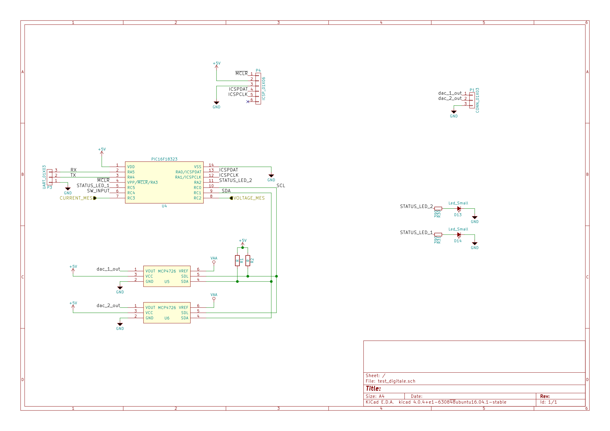

## Diary log of the design process

### Agilent schematics

The schematics that Mr. Tombola gave us came from the incredibly good Agilent E361x series. After a little research i were able to find the maintenance manual, with the schematics and a bill of material.

This is the schematic

As you can see it's divided into small sections. Here is a brief description of the sections behavior.

* *Reference and Bias supply* hosts not only the reference and bias supply, but also the current reference generator, which will be discussed later. The reference supply is powered form a separate tap on the main transformer. The current from this tap is rectified, filtered and then fed through some linear regulators, (78xx/79xx). The outputs form this regulators are all the logic rails of the system

  ***An important note*** the ground of this tap is not system earth, but is connected to the high rail of the power rail. This mean that with respect to earth the logic supply swings according to the changes in the output voltage. The aforementioned configuration gives a lot of benefits, mainly it removes the necessity of using special opamps that can work on the full power output ranges. The big disadvantage is the need for another tap in the transformer.

* *Current & Voltage Error Amplifier*s This is the core of the schematic, those two circuits are the one that implement all of the regulation of our PSU.

  * *Current error amplifier* This is an inverting amplifier, the circuit must be studied together with the opamp circuit in the reference and bias supply. This last circuit basically gives the error amplifier something to comaper the current with. The current limit is set by using the potentiometer (R16) 
  * *Voltage error amplifier* This also is an inverting amplifier. The reference in this case in generated via a voltage divider controlled by a variable resistor. This reference will set the voltage when in Constant Voltage mode.

* *Series Pass Transistor & Driver* This two elements are very intuitive. The first one is the driving element, while the second one is the gate driver, on order to not pull current form the Error Amplifier circuits.

* *CV/CC Indicator Circuit* Well, not much to say here. This part is used just to light some led on the front panel according to the mode in which the PSU is working in.

The modification that we are applied can be described according to their location.

Regarding the Voltage error amplifier, we opted to swap the fixed +5V reference with a DAC, in order to be able to control with a uC. This modification may seem like an easy one but it's not and it will be described later.

On the Current Error Amplifier side, the solution was similar to the one done before, but we had to take into account the behavior of the current reference generator.

On the pass element side, we swapped the mosfet array for a single more powerful one. The rest of this stage remand mostly unchanged.

**How we will carry on the tests**

In order to test the Linear stage of the PSU Nicolo came up wit a great idea. Instead of routing the whole board equipped with the DACs and the uc, we could route a stripped version of the original Agilent design so that we could swap in the full analog control circuit or the digital one. This will hopefully improve our testing stage, making it easier, because we could choice weather or not put in the digital circuit which is porobably the most complicated part.

### The digital control circuit

I wanted to go full digital, using DSP and some control routines, but Mr. Tombola advised me against this desing decision because of it't complexity.

So we seattled for a PIC uC and some DACs. The schematic of the digital part can be seen here. 

The first thing that can be seen is the super skookum PIC. This PIC has a lot of cool feature, like an internal HS Clock Generator (*32 MHz*), 10 bit ADC, SPI & UART module.

The most interesting part about this thing in my opinion is the internal oscillator. No need to bother with quartz resonant circuits or with very expensive oscillators, everything is inside the chip. As a side note, in one of the errdata is mentioned that a particular procedure <u>must</u> be followed when configuring the HS Oscillator.

We decided leverage as much as we could the uC capabilities. To do so, we decided to use the analog inputs  to sense the current and the voltage, we connected two GPIO the CV/CC indicators and we added two leds, just to make sure that the thing shines a bit.

Setting aside the less useful parts, the main focus was to be able to generate a variable DC voltage. We could have used the integrated DAC on the pic, but because of it's poor resolution we decided to opt for some external DAC, which were also made by MicroChip.  These DACs are controlled using the I2C protocol, the only caveat is that the adress is not setted via some pins on the uC, but it's burned directly on the silicon chip. This means that the adress must be chosen when ordering the parts, so a lot of attention must be paid to the last digits of the serial number.

I plan to write the code for this chip using MCC, which is a plug in of MPLABXIDE, this software is made by MicroChip and can provide some neat ways of configuring the device. The whole device configuration is done via a drag'n drop graphical interface. It also provide some libraries that can help us using the device peripheries.

 