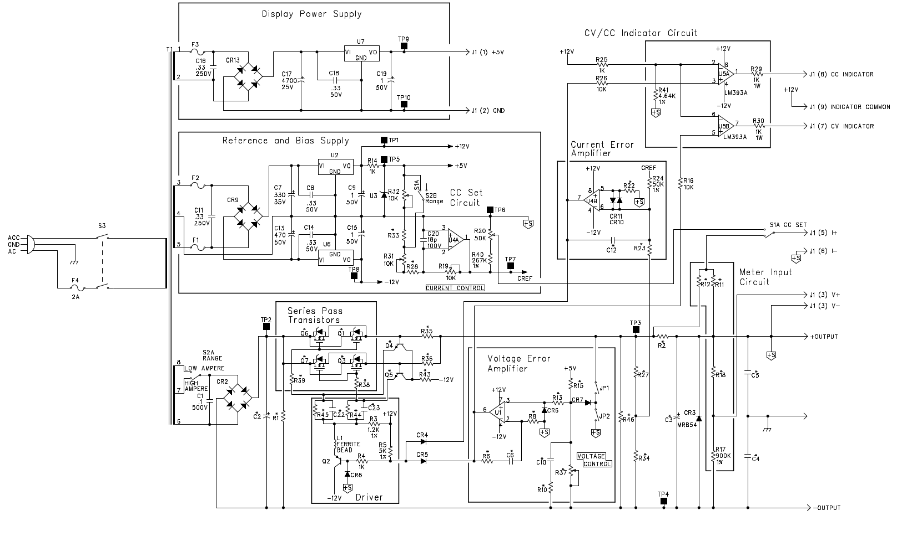
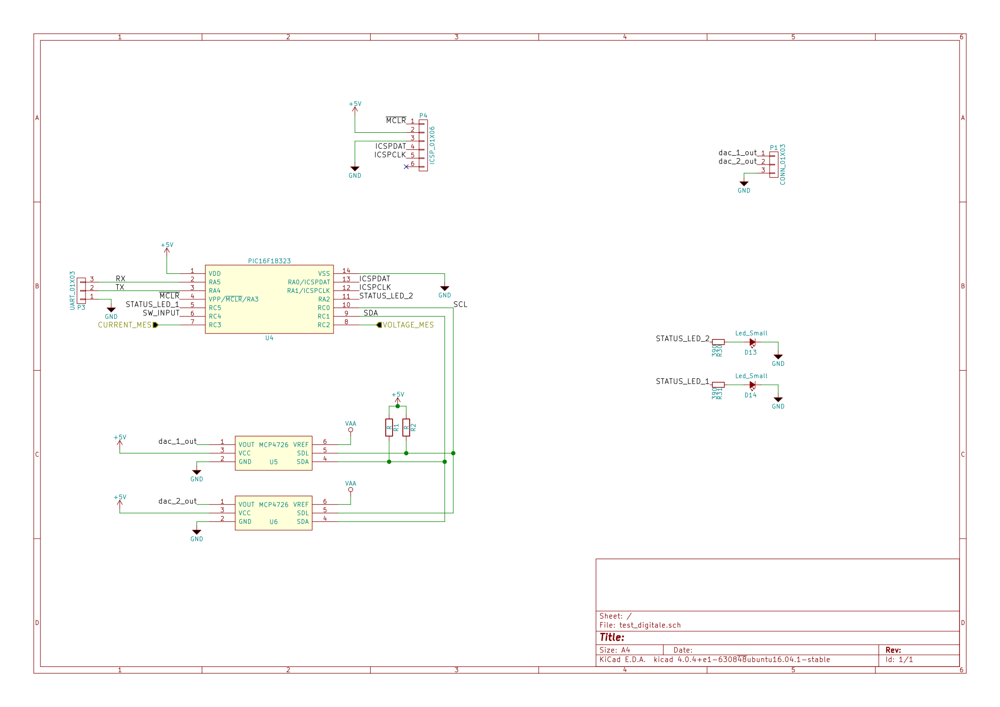

## Diary log of the design process

### Agilent schematics

The schematics that Mr. Tombola gave us came from the incredibly good Agilent E361x series. After a little research I was able to find the maintenance manual, with the schematics and a bill of material.

This is the schematic

As you can see it's divided into small sections. Here is a brief the behavior of each section.

* *Reference and Bias supply* hosts not only the reference and bias supply, but also the current reference generator, which will be discussed later. The reference supply is powered by a separate tap on the main transformer. The current from this tap is rectified, filtered and then fed through some linear regulators, (78xx/79xx). The outputs from these regulators are the logic power rails

  ***An important note*** the ground of this tap is not earth, but is connected to the high rail of the output power rail. This means that with respect to the earth the logic supply swings according to the changes in the output voltage. The aforementioned configuration gives a lot of benefits, mainly it removes the necessity of using special opamps that can work on the full power output ranges. The big disadvantage is the need for another tap in the transformer.

* *Current & Voltage Error Amplifier*s This is the core of the schematic, those two circuits are the ones that implement all of the regulation of our PSU.

  * *Current error amplifier* This is an inverting amplifier, the circuit must be studied together with the opamp circuit in the reference and bias supply. This last circuit basically gives the error amplifier a reference. The current limit is set by using the potentiometer (R16) 
  * *Voltage error amplifier* This also is an inverting amplifier. The reference in this case is generated via a voltage divider controlled by a variable resistor. This reference will set the voltage when in Constant Voltage mode.

* *Series Pass Transistor & Driver* These two elements are very intuitive. The first one is the driving element, while the second is the gate driver, in order not to pull current from the Error Amplifier circuits.

* *CV/CC Indicator Circuit* Well, not much to say here. This part is used just to light some LEDs on the front panel according to the mode in which the PSU is working.

The modifications that we have applied can be described according to their location.

Regarding the Voltage error amplifier, we opted to swap the fixed +5V reference with a DAC, in order to be able to control it with a uC. This modification may seem like an easy one but it's not and it will be described later.

On the Current Error Amplifier side, the solution was similar to the one done before, but we had to take into account the behavior of the current reference generator.

On the pass element side, we swapped the mosfet array for a single more powerful one. The rest of this stage remained mostly unchanged.

**How we will carry out the tests**

In order to test the Linear stage of the PSU Nicolo came up with a great idea. Instead of routing the whole board equipped with the DACs and the uC, we could route a stripped version of the original Agilent design so that we could swap in the full analog control circuit for the digital one. This will hopefully improve our testing stage, making it easier, because we could choose whether or not to put in the digital circuit which is probably the most complicated part.

### The digital control circuit

I wanted to go full digital, using DSP and some control routines, but Mr. Tombola advised me against this design decision because of its complexity.

So we settled for a PIC uC and some DACs. The schematic of the digital part can be seen here. 

The first thing that can be seen is the super skookum PIC. This PIC has a lot of cool features, like an internal HS Clock Generator (*32 MHz*), 10 bit ADC, SPI & UART module.

The most interesting part about this thing in my opinion is the internal oscillator. No need to bother with quartz resonant circuits or with very expensive oscillators, everything is inside the chip. As a side note, in one of the errdata a particular procedure is mentioned that <u>must</u> be followed when configuring the HS Oscillator.

We decided to leverage the uC capabilities as much as we could. To do so, we decided to use the analog inputs  to sense the current and the voltage, we connected two GPIO to the CV/CC indicators and we added two LEDs, just to make sure that the thing shines a bit.

Setting aside the less useful parts, the main focus was to be able to generate a variable DC voltage. We could have used the integrated DAC on the PIC, but because of its poor resolution we decided to opt for some external DAC, which were also made by MicroChip.  These DACs are controlled using the I2C protocol, the only caveat is that the address is not set via some pins on the uC, but it's burned directly on to the silicon chip. This means that the address must be chosen when ordering the parts, so a lot of attention must be paid to the last digits of the serial number.

I plan to write the code for this chip using MCC, which is a plug-in of MPLABXIDE, this software is made by MicroChip and can provide some neat ways of configuring the device. The whole device configuration is done via a drag'n drop graphical interface. It also provides some libraries that can help us using the device peripheries.

 